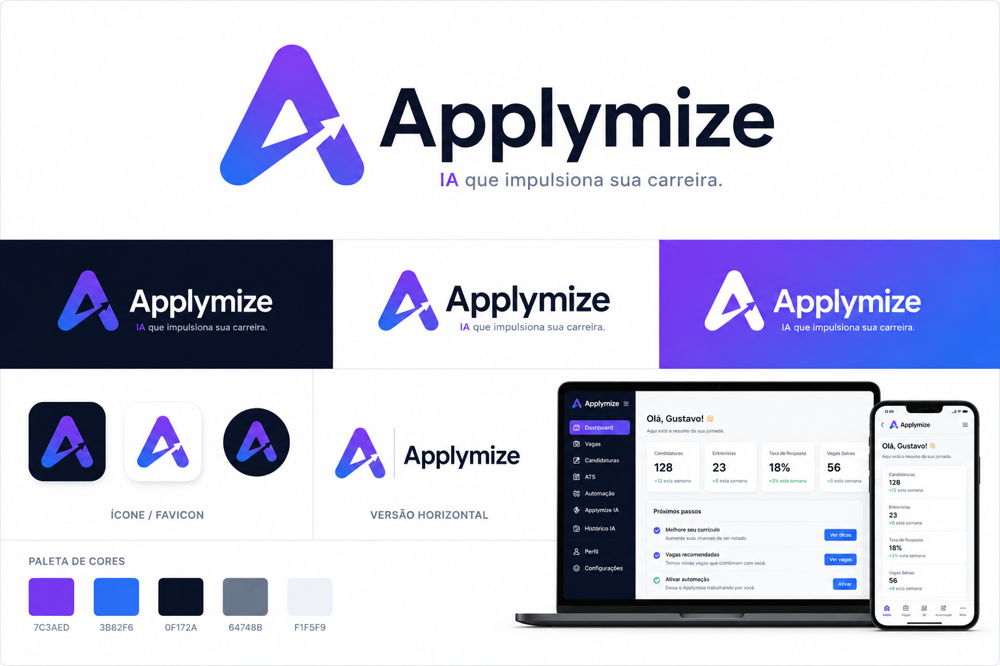

# Applymize

Plataforma autoral de inteligencia de carreira criada como portfolio full-stack e ferramenta de uso pessoal.

O projeto reune descoberta de vagas, filtro de relevancia, matching, analise ATS, acompanhamento de candidaturas, automacoes e alertas em uma experiencia construida com FastAPI, PostgreSQL, React, Vite e Docker Compose.

[Site publico](https://applymize.netlify.app)

## Visao geral

Applymize organiza o fluxo de candidatura em uma unica experiencia: encontrar vagas, avaliar aderencia, acompanhar status e apoiar proximos passos com automacao e IA contextual.

## Problema que resolve

- Busca manual em multiplas plataformas.
- Falta de criterio consistente para relevancia e matching.
- Curriculos e vagas avaliados sem contexto.
- Acompanhamento de candidaturas disperso.

## Arquitetura

```text
frontend/      interface publica e privada
backend/       API, autenticacao e servicos
automation/    automacoes e integracoes
intelligence/  scoring, ATS e contexto de IA
docs/          branding e documentacao
tests/         testes de regressao
```

## Screenshots




## Funcionalidades

- Descoberta de vagas em multiplas plataformas.
- Matching e scoring de aderencia.
- Laboratorio ATS para PDF, DOCX, TXT e texto colado.
- Demo publica interativa.
- IA contextual em funcao serverless.
- Auto-candidatura e funil Kanban persistente.
- Integração pessoal com WhatsApp.

## Tecnologias

Python, FastAPI, PostgreSQL, React, Vite, TypeScript, Docker Compose, Selenium, Groq API.

## Como executar

```bash
cp .env.example .env
docker compose up -d --build
```

Frontend local:

```bash
cd frontend
npm ci
npm run dev
```

## Estrutura do projeto

```text
backend/       API e dominio
frontend/      UI React
automation/    automacoes
intelligence/  scoring e IA
docs/          branding e documentacao
tests/         testes automatizados
```

## Roadmap

- Adicionar mais evidencias visuais no README.
- Expandir explicabilidade de matching e ATS.
- Evoluir observabilidade das automacoes.

## Licenca

TODO.
