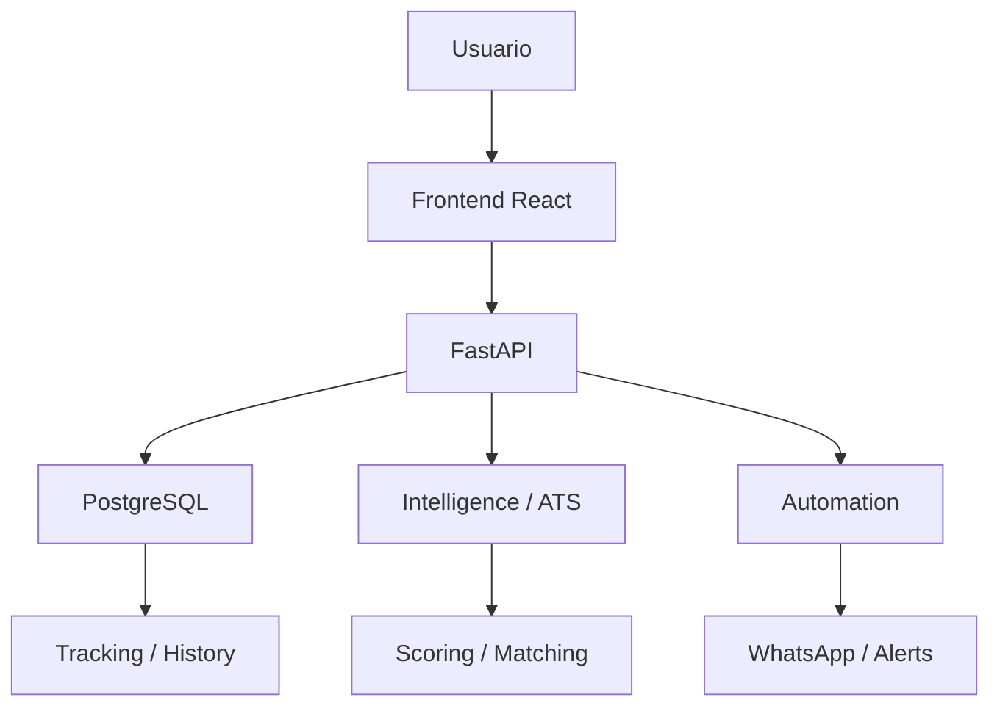
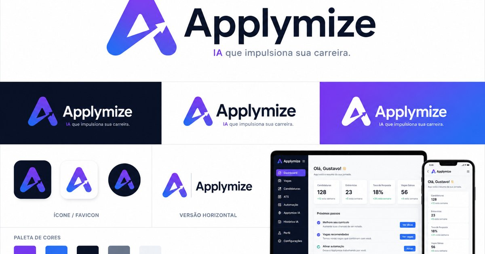

# Applymize

## Visao geral

Plataforma autoral de inteligencia de carreira criada como portfolio full-stack e ferramenta de uso pessoal. O projeto reune descoberta de vagas, filtro de relevancia, matching, analise ATS, acompanhamento de candidaturas, automacoes e alertas.

## Problema

- Busca manual em multiplas plataformas.
- Falta de criterio consistente para relevancia e matching.
- Curriculos e vagas avaliados sem contexto.
- Acompanhamento de candidaturas disperso.

## Solucao

Applymize organiza o fluxo de candidatura em uma unica experiencia: encontrar vagas, avaliar aderencia, acompanhar status e apoiar proximos passos com automacao e IA contextual.

[Site publico](https://applymize.netlify.app)

## Arquitetura



## Tecnologias

Python, FastAPI, PostgreSQL, React, Vite, TypeScript, Docker Compose, Selenium, Groq API.

## Funcionalidades

- Descoberta de vagas em multiplas plataformas.
- Matching e scoring de aderencia.
- Laboratorio ATS para PDF, DOCX, TXT e texto colado.
- Demo publica interativa.
- IA contextual em funcao serverless.
- Auto-candidatura e funil Kanban persistente.
- Integracao pessoal com WhatsApp.

## Demonstração

- Demo publica: [applymize.netlify.app](https://applymize.netlify.app)
- Laboratorio ATS: rota publica da demo

## GIF

TODO: gravar um GIF curto com busca de vaga, scoring ATS e avanco de candidatura no Kanban.

## Screenshots



## Como executar

```bash
cp .env.example .env
docker compose up -d --build
```

Frontend local:

```bash
cd frontend
npm ci
npm run dev
```

## Estrutura do projeto

```text
backend/       API e dominio
frontend/      UI React
automation/    automacoes
intelligence/  scoring e IA
docs/          branding e documentacao
tests/         testes automatizados
assets/demo/   screenshots e GIFs
```

## Roadmap

- Adicionar GIFs curtos das jornadas principais.
- Expandir explicabilidade de matching e ATS.
- Evoluir observabilidade das automacoes.

## Principais aprendizados

- Arquitetura em camadas
- APIs REST
- Docker
- PostgreSQL
- Machine Learning
- FastAPI
- React
- Clean Architecture
- Design Patterns
- Automacoes
- Engenharia de Dados

## Licenca

TODO.
